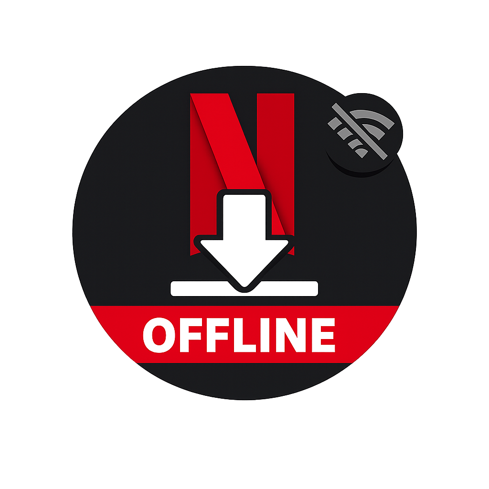
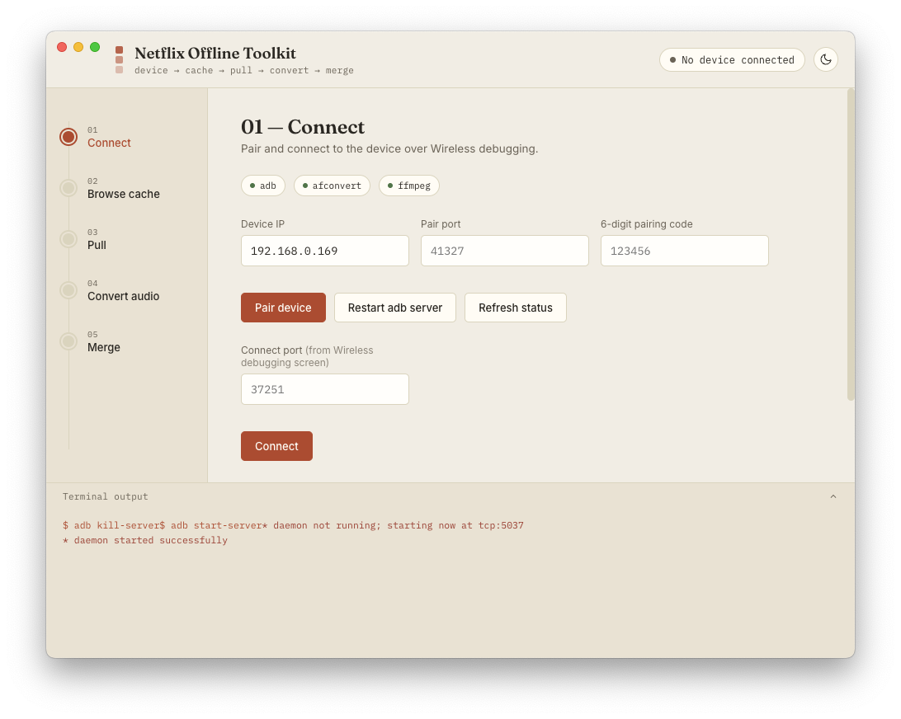

<p align="center">
  
</p>

<p align="center">
  
</p>


# Netflix Offline Toolkit (Electron)

A native macOS app version of `netflix_offline.sh` — pulls Netflix offline
downloads off an Android device over ADB, then optionally converts the
`.nfa` audio to `.wav` and merges it back into the `.mp4` video.

Runs `adb`, `afconvert`, and `ffmpeg` directly via the Electron main
process — no Python server, no extra backend.

## Requirements

- macOS (afconvert is macOS-only; the rest works cross-platform)
- Node.js + npm
- `adb` on your PATH (Android Platform Tools)
- `ffmpeg` on your PATH
- `afconvert` (ships with macOS — no install needed)

## Setup

```bash
cd netflix-offline-electron
npm install
npm start
```

## Build a .app / .dmg

```bash
npm run dist
```

This produces, in `release/`:
- `Netflix Offline Toolkit.app` (also zipped) for both Apple Silicon and Intel
- `Netflix Offline Toolkit.dmg` installer for each architecture

The build is unsigned (no Apple Developer ID attached), so on first launch
macOS Gatekeeper will block it. Right-click (or Control-click) the app →
**Open** → **Open** again to approve it once. After that it opens normally.

If you just want the unpacked `.app` without the dmg/zip step, run
`npm run dist:dir` instead — faster, output lands in `release/mac` (or
`release/mac-arm64`).


## How it works

The app walks the same five steps as the original script, now as a
filmstrip-style pipeline in the sidebar:

1. **Connect** — pair + connect to the device over Wireless debugging
   (`adb pair`, `adb connect`). Includes a one-click `adb kill-server` /
   `adb start-server` restart for the classic stale-pairing error.
2. **Browse cache** — lists the Netflix offline cache folder on the
   device (`adb shell ls -la ...`) so you can click the title you want.
3. **Pull** — copies that folder to a local destination (`adb pull`) and
   reveals it in Finder.
4. **Convert audio** — runs `afconvert -f WAVE -d LEI16` on the `.nfa`
   file to produce a `.wav`.
5. **Merge** — muxes the `.wav` back into the source `.mp4` with ffmpeg
   (`-map 0:v -map 1:a -c:v copy -c:a aac`).

A collapsible terminal drawer at the bottom shows the exact commands and
their live output, same spirit as the colored echo statements in the
original bash script.

## Notes

- Default device IP (`192.168.0.169`) and cache path
  (`/sdcard/android/data/com.netflix.mediaclient/files/download/.of/`)
  match the original script's defaults — both are editable in the UI.
- Theme toggle in the top right switches between a paper/light mode and
  a dark mode.
- This is wired up with `electron-builder` (see "Build a .app / .dmg"
  above) — `npm start` still works for quick dev iteration.
 
